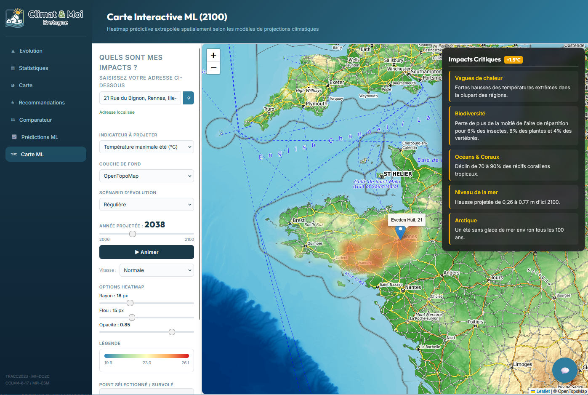
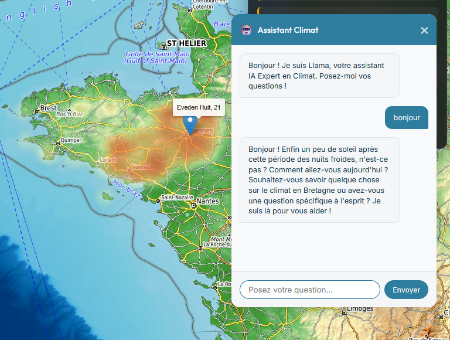
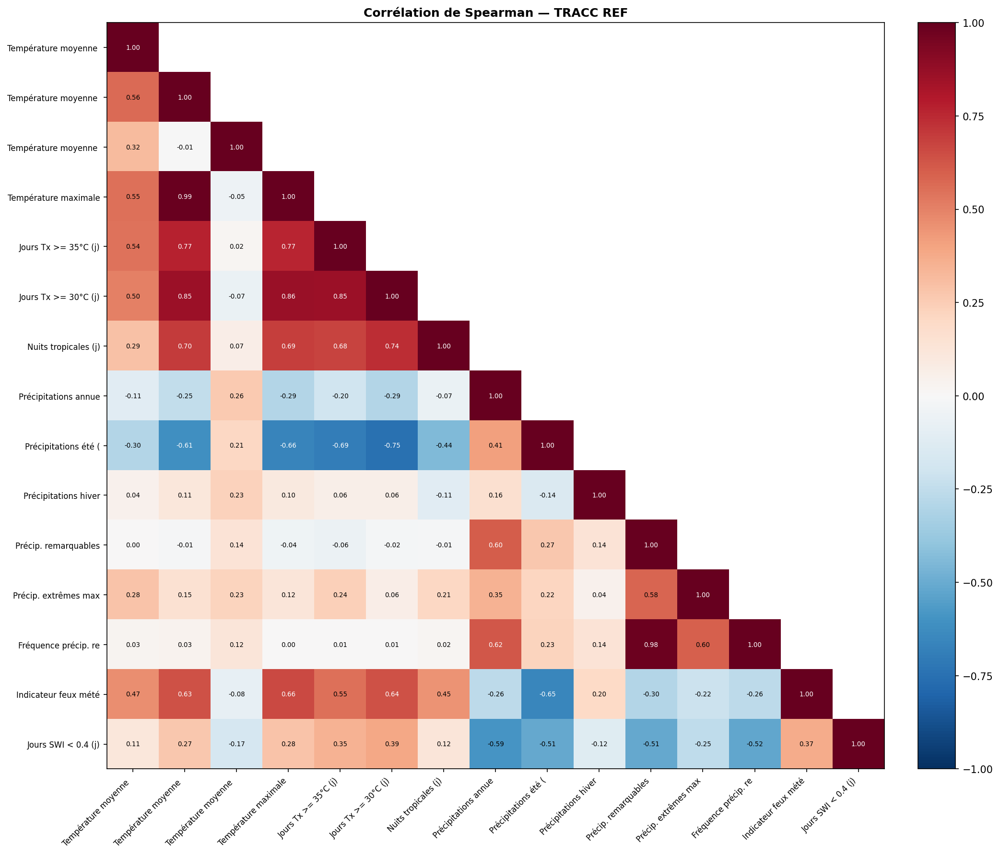
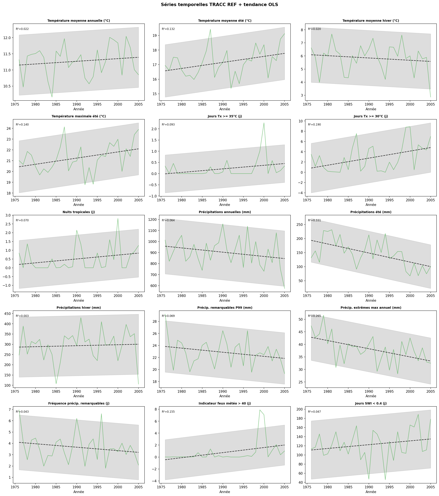
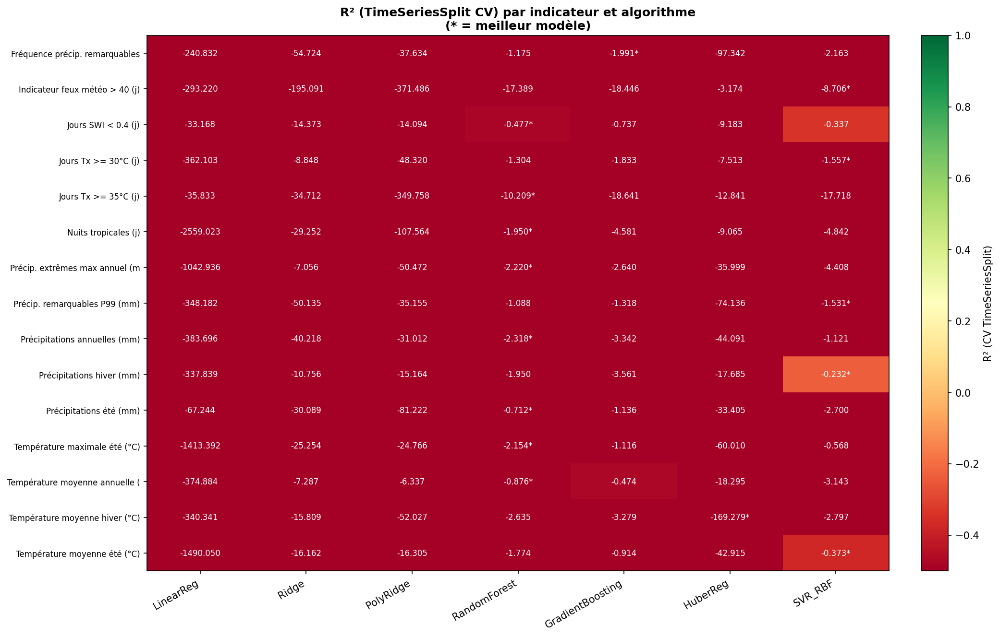
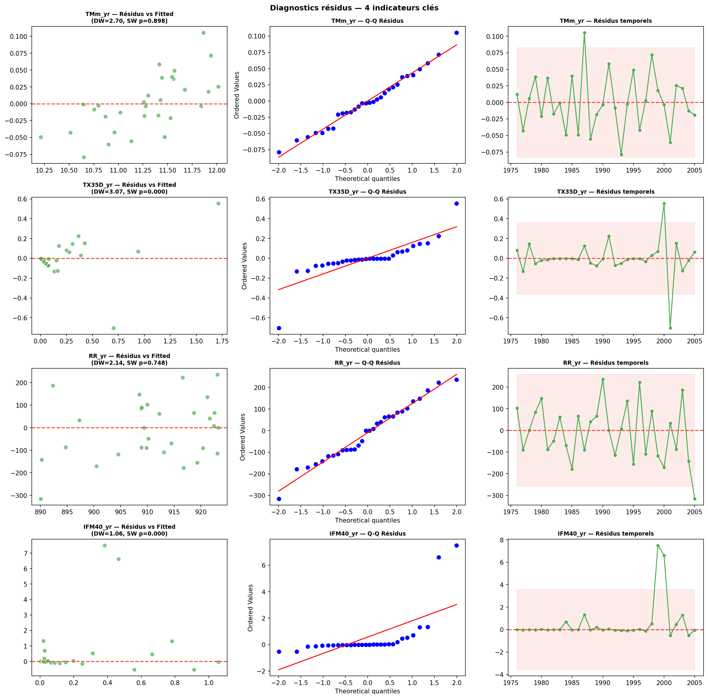
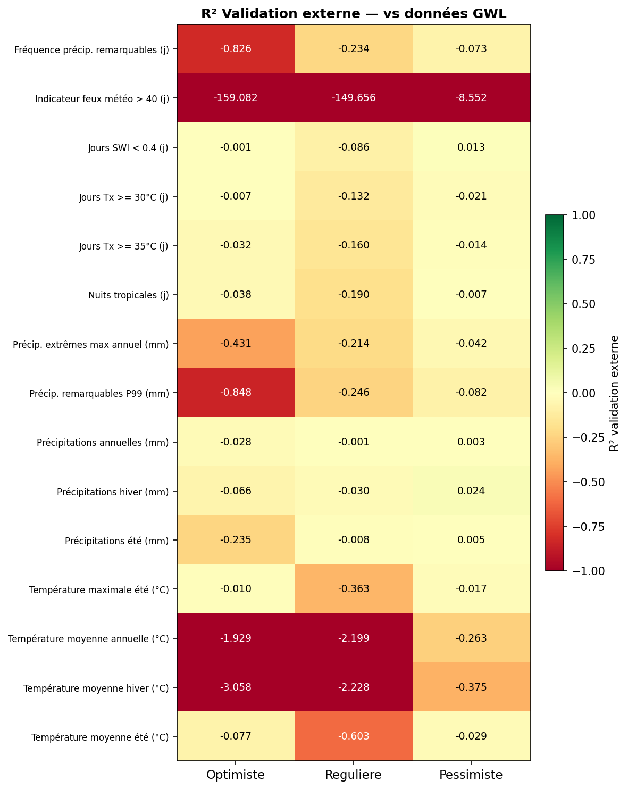
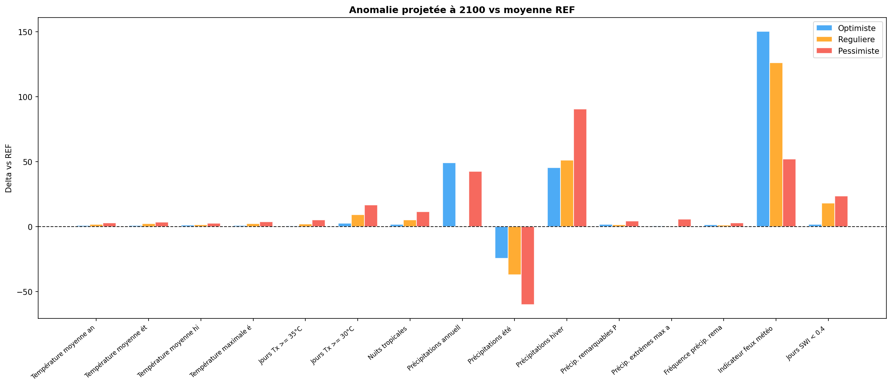
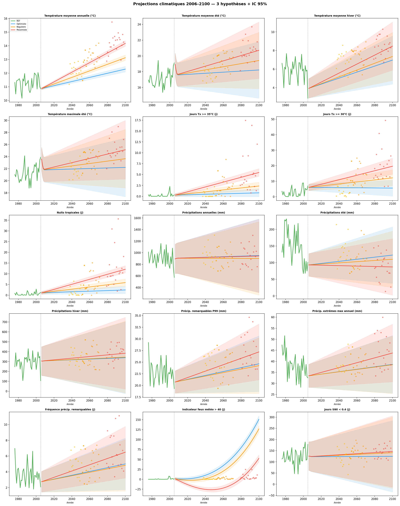

# Climat & Moi - Bretagne (Plateforme de Sensibilisation Régionale)

## Présentation du Projet
Ce projet est une solution complète de sensibilisation aux enjeux climatiques régionaux, pensée prioritairement pour les citoyens. 
Le parcours utilisateur débute dans le monde physique grâce à un **Flyer de sensibilisation** (disponible dans `static/flyer.pdf`) distribué à la population. Ce support synthétique et percutant invite ensuite l'utilisateur à se rendre sur cette plateforme web interactive (`flask_app`) pour approfondir ses connaissances, explorer les données locales et découvrir précisément ses propres impacts et recommandations de vie (réflexes d'urgence, gestes du quotidien).

---

## Architecture de l'Application

La totalité de la plateforme réside dans l'environnement `flask_app` :

```text
flask_app/
├── Dockerfile                  # Configuration de construction de l'image Docker
├── .dockerignore               # Fichiers ignorés lors du build
├── app.py                      # Point d'entrée serveur Flask et contrôleur (Routes)
├── parse_tracc_spatial.py      # Script de préparation des données spatiales
├── tracc_prediction.ipynb      # Modèle de Machine Learning expérimental/prédictif
├── requirements.txt            # Dépendances Python du projet
├── data/                       # Magasin de données locales
│   ├── implications.xlsx       # Base de données des "Réflexes d'Urgence"
│   ├── phenomenes.json         # Données vulgarisatrices textuelles
│   ├── tracc_meta.json         # Métadonnées des modèles climatiques (TRACC)
│   ├── tracc_data.json         # Séries temporelles absolues par indicateur
│   └── tracc_spatial.json      # Valeurs maillées pour le rendu cartographique
├── static/                     # Assets publics Web (CSS, JS, Images, PDF)
│   ├── css/main.css            # Charte graphique globale (UI Dashboard)
│   ├── js/                     # Logique Métier Client (Chart.js, Leaflet)
│   │   ├── base.js             # Scripts globaux (Menu, Sidebar)
│   │   ├── carte.js            # Moteur cartographique
│   │   ├── comparateur.js      # Mécanique comparative (Radars, Barres)
│   │   ├── evolution.js        # Vues historiques et prospectives
│   │   └── statistiques.js     # Analyse de distribution
│   ├── flyer.pdf               # Le support de distribution physique (Passerelle Web)
│   └── img/                    # Logos et Assets graphiques (titre, logos...)
└── templates/                  # Vues HTML/Jinja2 de l'application
    ├── base.html               # Layout parent (Menu latéral)
    ├── carte.html              # Vue Carte Choroplèthe
    ├── comparateur.html        # Module de comparaison multi-période et multi-critère
    ├── evolution.html          # Module de suivi de tendance climatique
    ├── statistiques.html       # Module de visualisation de dispersion (Boxplots...)
    └── recommandations.html    # Hub d'action citoyenne et de recommandations
```

---

## Les Données de Base

L'application s'appuie sur plusieurs sources intégrées :
*   **Données Climatiques (TRACC - Météo-France) :** Un ensemble de variables climatiques de haute définition régionalisées (ex: Température moyenne, Jours sans pluie, Cumul de précipitations). Ces données sont réparties entre les séries macroscopiques (`tracc_data.json`) et la finesse territoriale (`tracc_spatial.json`).
*   **Données Citoyennes (Vulgarisation) :** `implications.xlsx` contient une matrice actions/conséquences permettant de traduire une anomalie climatique en "Réflexes" concrets pour le citoyen (Comment se protéger, quoi prévoir dans le bâtiment, etc.).
*   **Données Expliquées :** `phenomenes.json` offre le lexique climatique utilisé tout au long du site.

---

## Le Site Web : Parcours Utilisateur

Le site web a été conçu comme un **Dashboard Moderne** clair, accueillant, et dont la typographie met à l'aise le grand public tout en conservant la rigueur scientifique des données.

### 1. La Carte Interactive (Point d'Entrée)
L'utilisateur découvre d'abord les conséquences géographiques spatialisées du changement climatique en Bretagne à travers une heatmap interactive. Il peut sélectionner différents indicateurs (températures, précipitations) et observer l'évolution spatiale des anomalies climatiques.
> 

### 2. Les Recommandations Personnalisées
En saisissant son adresse, l'utilisateur a accès aux fameux "Réflexes", aux gestes du quotidien, et à un aperçu numérique du flyer. Cela permet de lier directement les données climatiques à des actions citoyennes concrètes et priorisées.
> 
> 
> 

### 3. Le Comparateur Climatique
L'utilisateur peut comparer frontalement des périodes ("les années 1990" face aux "années 2050") à travers des diagrammes RADAR normalisés et des courbes. Cette vue quantifie précisément l'évolution relative et absolue de l'empreinte climatique entre deux époques.
> 
> 

### 4. Suivi d'Évolution
Projections visuelles claires des indicateurs avec des repères temporels (Référence, +1.5°C, +2°C...).

### 5. Analyses Statistiques 
Pour un public plus aguerri, analyse des dispersions sous formes d'histogrammes ou statistiques descriptives.

### 6. Assistant Climat & Fonctionnalités ML
> 


---

## Le Modèle de Machine Learning

Outre la visualisation web, le projet embarque un volet expérimental de modélisation mathématique via `tracc_prediction.ipynb`.
Ce carnet de recherche implémente des approches algorithmiques pour analyser et extraire des tendances sur les données `tracc`.
Il vise à prédire l'évolution des indicateurs climatiques jusqu'en 2100 en tenant compte des contraintes temporelles et spatiales de la région Bretagne. L'exploration a mis en évidence des corrélations fortes, permettant de valider des modèles de régression robustes (évalués via R2 et analyse des résidus) avant d'extrapoler les projections.


### Prédictions et Résultats du Modèle
Voici les visuels issus de nos expérimentations de machine learning détaillées dans le notebook.

> 
> 
> 
> 
> 
> 
> 

---

## Lancement Rapide (Dev)

Pour instancier et exécuter l'application localement :

1. Créer un environnement virtuel (recommandé) :
   ```bash
   python -m venv venv
   source venv/bin/activate  # Sur macOS/Linux
   venv\Scripts\activate     # Sur Windows
   ```

2. Installer les dépendances :
   ```bash
   pip install -r requirements.txt
   ```

3. Démarrer le serveur Flask :
   ```bash
   python app.py
   ```

4. Ouvrir le navigateur et se rendre à l'adresse : [http://127.0.0.1:5000](http://127.0.0.1:5000)
